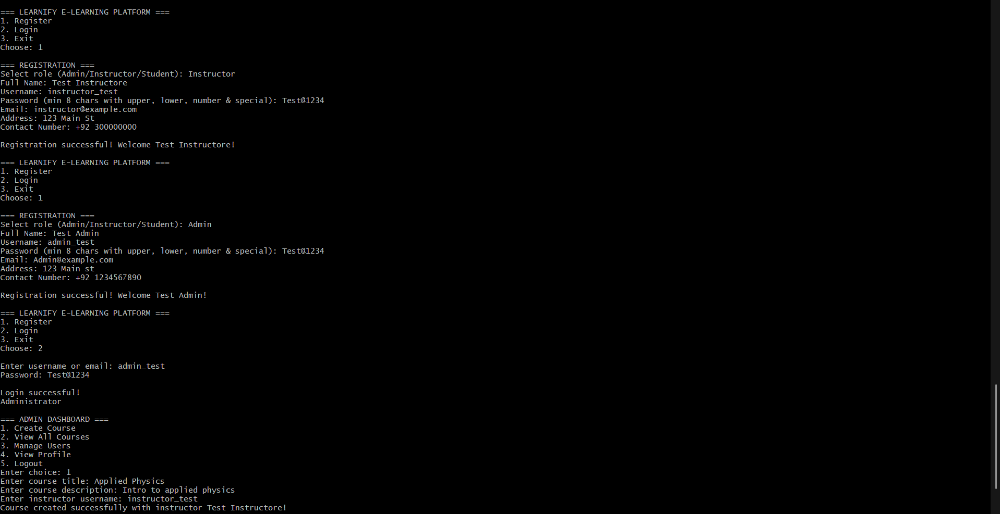

# Learnify — E-Learning Platform (C++)

A console-based e-learning platform I built in C++ with three user roles — Admin, Instructor, and Student — each getting their own menu and permissions. Handles course creation, enrollment, and quizzes, with everything saved to files so data persists between runs.

## What it does

- **Admin:** create courses (assigning an instructor), view all courses, manage users, view profile
- **Instructor:** create courses and quizzes for their students
- **Student:** view all courses, enroll, view enrolled courses, take quizzes, track progress, view profile
- Registration enforces a strong password policy (8+ chars, upper/lower/digit/special char)
- Login works with either username or email
- All data (users, courses) is stored in flat text files, no database

## Built with
C++, basic OOP structure (separate classes for roles/courses/quizzes), file I/O for persistence.

## Running it
g++ src/Complete.cpp -o learnify
./learnify

## Demo
=== LEARNIFY E-LEARNING PLATFORM ===

Register
Login
Exit
Choose: 1

=== REGISTRATION ===
Select role (Admin/Instructor/Student): Admin
Full Name: Test Admin
Username: admin_test
Password: Test@1234
Email: admin@example.com
Address: 123 Main St
Contact Number: +92 3000000000
Registration successful! Welcome Test Admin!
=== ADMIN DASHBOARD ===

Create Course
View All Courses
Manage Users
View Profile
Logout
Enter choice: 1
Enter course title: Applied Physics
Enter course description: Intro to applied physics
Enter instructor username: instructor_test
Course created successfully!

## Screenshot

## Structure
Learnify/
├── src/Complete.cpp
├── data/
│   ├── courses.txt
│   └── users.txt
├── README.md
└── .gitignore

## Notes
User management for admins is still a work in progress — currently a stub. Next up: finishing that, and possibly migrating from flat-file storage to SQLite.
